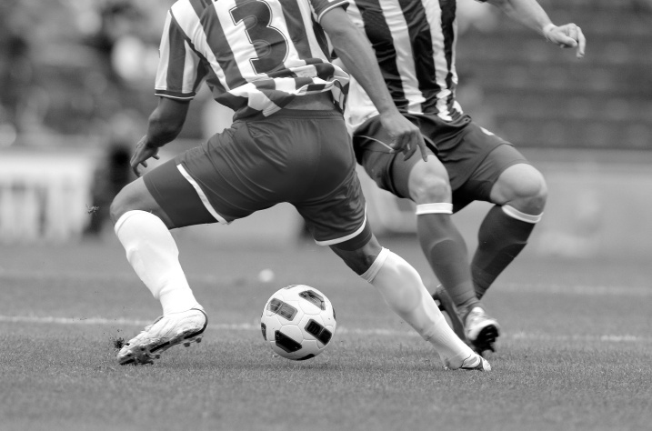

# 2. ✏️실습 내용

## 2-1. 이미지 불러오기, 색상 및 크기 변경, 출력

- 1. OpenCV 라이브러리를 불러온다.
- 2. cv.imread()를 사용하여 이미지를 읽어온다.
- 3. 이미지가 존재하지 않을 경우 프로그램을 종료한다.
- 4. cvtColor과 resize를 사용하여 이미지의 색상 및 크기를 변경한다.
- 5. cv.imwrite()를 사용하여 새로 저장, cv.imshow()를 사용하여 이미지를 화면에 출력한다.

###
```python
import cv2 as cv
import sys

img = cv.imread('soccer.jpg')

if img is None :
    sys.exit('파일이 존재하지 않습니다.')

gray=cv.cvtColor(img, cv.COLOR_BGR2GRAY) #BGR컬러 사진을 흑백 사진으로 변환 = Gray 사진
gray_small=cv.resize(gray,dsize=(0,0),fx=0.5,fy=0.5) #Gray 사진을 절반(0.5)으로 축소 = Gray_small 사진

cv.imwrite('soccer_gray.jpg',gray) # 새로 만든 Gray 사진을 soccer_gray라는 파일이름으로 저장
cv.imwrite('soccer_gray_small.jpg',gray_small) # 새로 만든 Gray_small 사진을 soccer_gray_small이라는 파일이름으로 저장

cv.imshow('Color image', img) #컬러 사진 표시
cv.imshow('Gray image', gray) #흑백 사진 표시
cv.imshow('Gray image small', gray_small) #작은 흑백 사진 표시

cv.waitKey()
cv.destroyAllWindows()

print(type(img))
print(img.shape)
```

###




