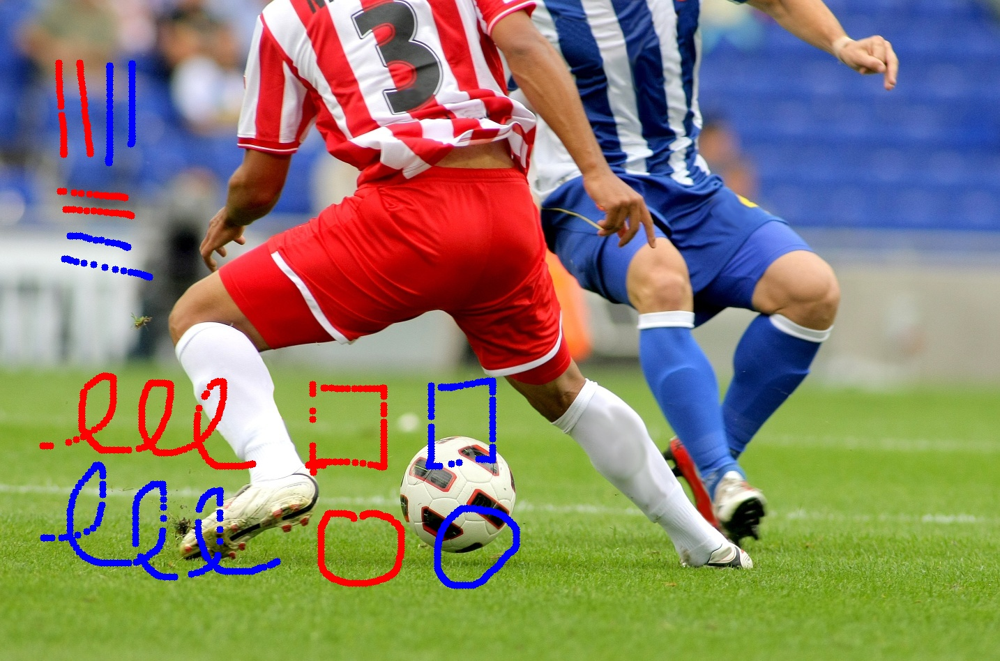

## 2-2. 이미지 위에 점으로 그림그리기

- 1. OpenCV 라이브러리를 불러온다.
- 2. cv.imread()를 사용하여 이미지를 읽어온다.
- 3. 이미지가 존재하지 않을 경우 프로그램을 종료한다.
- 4. draw 모듈 생성, 왼쪽 클릭, 오른쪽 클릭일 때 각각 빨강, 파랑 점을 생성한다.
- 5. 각각의 마우스 버튼을 누르고 있는 동안, 점이 이어져 그림을 생성한다.
- 6. 'q'키를 눌러 저장할 수 있도록 한다.
 
###

## 코드(python)

```python
import cv2 as cv
import sys

img = cv.imread('soccer.jpg')

if img is None :
    sys.exit('파일이 존재하지 않습니다.')

drawing_red = False
drawing_blue = False
brush_size = 5

def draw(event, x, y, flags, param):

    global drawing_red, drawing_blue # 전역 변수로 선언하여 함수 내에서 사용할 수 있도록 함

    if event == cv.EVENT_LBUTTONDOWN: #왼쪽 버튼을 누르면
        drawing_red = True

    elif event == cv.EVENT_RBUTTONDOWN: #오른쪽 버튼을 누르면
        drawing_blue = True

    elif event == cv.EVENT_MOUSEMOVE: # 마우스가 움직이는 동안
        if drawing_red:
            cv.circle(img,(x,y),brush_size,(0,0,255),-1) # 빨간 점
        elif drawing_blue:
            cv.circle(img,(x,y),brush_size,(255,0,0),-1) # 파란 점

    elif event == cv.EVENT_LBUTTONUP: #왼쪽 버튼에서 손을 떼면
        drawing_red = False

    elif event == cv.EVENT_RBUTTONUP: #오른쪽 버튼에서 손을 떼면
        drawing_blue = False

    cv.imshow('Drawing', img)

cv.namedWindow('Drawing')
cv.imshow('Drawing',img)

cv.setMouseCallback('Drawing',draw)

while(True): #무한 루프를 돌면서 키 입력을 기다림
    if cv.waitKey(1)==ord('q'): #'q' 키를 누르면 루프를 종료
        break

cv.destroyAllWindows()

#저장 (지금 올린 코드 방식과 동일)
cv.imwrite('soccer_drawing.jpg', img)
```

###

## 결과물



