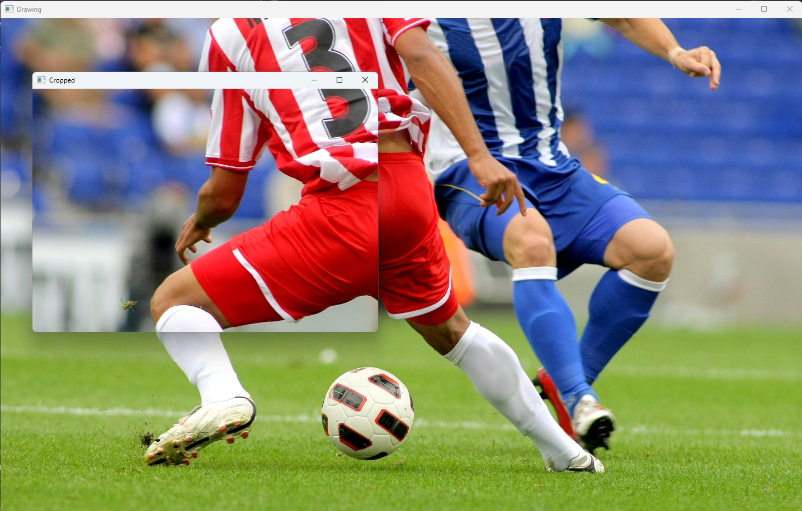

## 2-3. 선택 범위만큼 새로운 이미지 생성

- 1. OpenCV 라이브러리를 불러온다.
- 2. cv.imread()를 사용하여 이미지를 읽어온다.
- 3. 이미지가 존재하지 않을 경우 프로그램을 종료한다.
- 4. 마우스를 클릭하고 있는 동안, 처음 클릭한 지점에서 드래그를 하면 직사각형을 생성한다.
- 5. 마우스 버튼을 놓으면, 그 위치를 저장, 직사각형 만큼의 범위를 따로 저장한다.
- 6. 따로 저장된 직사각형 범위를 새로운 이미지로 저장하여 출력한다.

###

## 코드(python)

```python
import cv2 as cv
import sys

img = cv.imread('soccer.jpg')

if img is None:
    sys.exit('파일이 존재하지 않습니다.')

dragging = False # 드래그 상태를 나타내는 변수
ix, iy = -1, -1 # 드래그 시작점의 좌표를 저장하는 변수 (초기값은 -1로 설정)

def draw(event, x, y, flags, param): # 마우스 이벤트를 처리하는 콜백 함수

    global dragging, ix, iy, img # 전역 변수로 선언하여 함수 내에서 사용할 수 있도록 함

    if event == cv.EVENT_LBUTTONDOWN: # 왼쪽 버튼을 누르면 드래그 시작
        dragging = True
        ix, iy = x, y

    elif event == cv.EVENT_MOUSEMOVE: # 마우스가 움직이는 동안 드래그 중이면 사각형을 그려서 보여줌
        if dragging:
            temp = img.copy()
            cv.rectangle(temp, (ix, iy), (x, y), (0,255,0), 2)
            cv.imshow('Drawing', temp)

    elif event == cv.EVENT_LBUTTONUP: # 왼쪽 버튼에서 손을 떼면 드래그 종료, 선택된 영역을 잘라서 보여주고 저장
        dragging = False

        roi = img[iy:y, ix:x]

        if roi.size != 0:
            cv.imshow('Cropped', roi)
            cv.imwrite('cropped.jpg', roi)

cv.namedWindow('Drawing') # 드로잉 창 생성
cv.imshow('Drawing', img) # 원본 이미지를 드로잉 창에 표시

cv.setMouseCallback('Drawing', draw) # 드로잉 창에 마우스 이벤트가 발생할 때마다 draw 함수를 호출하도록 설정

while True: # 무한 루프를 돌면서 키 입력을 기다림
    if cv.waitKey(1) == ord('q'):
        break

cv.destroyAllWindows()
```

###

## 결과물


